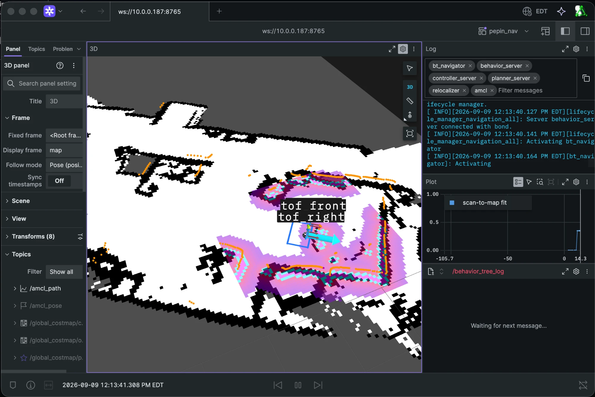

# Pepin

A differential-drive indoor cart that drives itself to a named place on a saved map —
localisation, planning, control and recording all on a $35 single-board computer.



*One goal in flight: the static map underneath, the live scan on top of it, the three ToF cones
marked into the local costmap, and the pose the scan matcher is holding.*

## What it is

Say `ros/go.sh printer` and the cart goes to the printer. It knows where it is because it
matches every lidar revolution against a map of the flat; it knows what is in front of it
because the lidar and three time-of-flight sensors write into the costmaps ten times a second;
it stops with its bumper against the furniture, because that is where a manipulator has to
reach.

Pepin is the mobility organ of a companion robot that does not exist yet. Everything the arm
and the face will one day need — a frame that stays true, a body that fits through doorways,
a name for every place in the flat, a recording of every drive — is being built here first,
on an IKEA cart with two servos for wheels.

Everything that closes a loop runs on the robot: the board is an Orange Pi Zero 3 with four
Cortex-A53 cores and 1.5 GB of RAM, and it carries ROS 2 Jazzy, the EKF, the scan-matching
tracker, the local costmap, the controller and the behaviour tree. The laptop is never in the
stop reflex, and every drive's tape is written on the board. The laptop reaches the robot over
one TCP link (`zenoh-bridge-ros2dds`): it can take the planner with its global costmap and the
goal server, or — the daily mode — leave the whole drive to the board and run the camera SLAM
beside it, since a Nav2 action does not survive the bridge and a map can wait a second. Either
way the operator watches through Foxglove and sends one line of JSON when the robot should go
somewhere.

## Numbers

Measured on the robot, on the board, during real drives.

| What | Value |
| --- | --- |
| Scan match against the map, on the board | 37–40 ms mean |
| Scan-to-odometry wait (EKF latency) | 43–50 ms mean |
| Heading-rate residual vs commanded, p90 | 6 °/s (26 °/s before the timeline module) |
| Cross-track error, p90 | 6 cm under Hybrid-A*, 4 cm under the point planners |
| Top speed | 0.30 m/s — the base's own cap, and the wheels reach it |
| A 2.5 m printer → home leg | 16–21 s |
| A 3.9 m leg to the printer, Hybrid-A* | 34 s, 1% of it turning in place — 35% under the point planners |
| Localisation confidence | 0.68–0.70 standing, 0.84 driving |
| Loop closure over a 33 m lap (mapping) | 5 cm |
| Goal tolerance | 0.10 m / 0.20 rad |
| Board memory with the whole stack up | 590 MB used, 5 MB swap (1.08 GB and a full 734 MB swap before tracetools was rebuilt without LTTng) |
| Unit tests | 376, mypy strict, 86% coverage floor |

## Architecture

```
 LAPTOP                                  │ BOARD — Orange Pi Zero 3 (4x Cortex-A53, 1.5 GB)
                                         │ one Docker container: ROS 2 Jazzy + Nav2 1.3.12
 ros/go.sh printer ─── TCP 3337 ─────────┼─► goal_server ──► bt_navigator ──► planner_server
        (JSON lines: run number,         │        │              │            global costmap 2 Hz
         events, tape path)              │        │              │ /plan
                                         │        │              ▼
 Foxglove ◄── ws 8765 ── foxglove_bridge │        │        controller_server   RPP 10 Hz
                                         │        │        local costmap 3x3 m @ 5 cm, 5 Hz
 rsync   ◄── camera clip (curl on board) │        │              │ /cmd_vel_nav
 rsync   ◄── run .jsonl, board log ──────┼─ run_recorder         ▼
                                         │        ▲        velocity_smoother   10 Hz
                                         │        │              │ /cmd_vel
                                         │        │        base_bridge (C++)
                                         │        │              │ TCP 3336, JSON lines
                                         │        │        pepin-base   50 Hz, deadman 0.5 s
                                         │        │              │ ser2net :3333
                                         │        │        2x Feetech STS3215
                                         │        │
                                         │ ─── sensing ─────────────────────────────────────
                                         │ LD19 ─► ldlidar ─► hull box filter ─► /scan  10 Hz
                                         │ encoders ─► pepin-base ─────────────► /odom  16 Hz
                                         │ MPU6050 ─► base_bridge ──────► /imu/data_raw  44 Hz
                                         │ /odom + /imu ─► ekf_node ─► odom→base_link    20 Hz
                                         │ /scan + map ─► relocalizer ─► map→odom        20 Hz
                                         │ 3x VL53L1X ─► pepin-tof :3335 ─► tof_bridge
                                         │              ─► /tof/{front,left,right}       14 Hz
```

The sensor nodes and the base bridge are composed into one container process at `nice -10`; Nav2
runs in a second one at `nice +5`, so a busy planner can never starve the lidar. Every process
that could be a separate node and is not saves about 140 MB on a 1.5 GB board.

### Timing

| Loop | Rate |
| --- | --- |
| Lidar revolution | 10 Hz, 455 beams |
| Wheel odometry (`/odom`) | 16 Hz |
| Gyro (`/imu/data_raw`) | 44 Hz |
| EKF, `odom → base_link` | 20 Hz |
| Scan match | every scan while moving, ≥1 Hz standing still |
| `map → odom` broadcast | 20 Hz |
| Lost check (is the pose still trustworthy?) | 1 Hz |
| Tracker timing report | every 30 s |
| Controller (Regulated Pure Pursuit) | 10 Hz |
| Velocity smoother | 10 Hz |
| Local costmap | update 5 Hz, publish 1 Hz |
| Global costmap | update 2 Hz, publish 1 Hz |
| Planner | up to 2 Hz |
| ToF, per sensor | 14 Hz |
| Wheel loop on the board | 50 Hz, 0.5 s deadman |
| Laptop heartbeat (split mode) | 2 Hz |

## How it drives

One command, end to end:

1. **`ros/go.sh printer`** opens a socket to the goal server on the board and writes one JSON
   line. No client boots, no ROS process starts: a goal costs a socket write, not the 8–15 s
   an ssh-and-import client used to cost.
2. **The goal server** looks the name up in the map's own places book (`<map>.places.yaml`),
   takes the next run number, opens the tape — which already holds the last 15 s of every topic,
   so the file begins *before* the command did — starts the camera clip beside it, and sends the
   pose to Nav2. It answers with one JSON line per event: accepted, feedback, arrival, done.
3. **The behaviour tree** asks the selected planner for a path — that planner and no other. Stale
   cells are forgotten on a timer (local 1 Hz, global 0.1 Hz); a refused plan is answered by
   retreating 0.15 m, then by three seconds of waiting, then by a spin, one answer per retry and
   five retries, and a failed drive by a longer round robin — twenty attempts before giving up.
4. **Regulated Pure Pursuit** follows the path at 10 Hz, slowing on curvature and on costmap cost.
5. **The velocity smoother** limits acceleration, and **the C++ base bridge** turns `/cmd_vel`
   into a twist on a TCP socket.
6. **`pepin-base`** on the host owns the wheels: it applies the twist and reads the encoders at
   50 Hz next to the UART, and a 0.5 s deadman cuts the motors if anything upstream goes quiet.
   The two **Feetech STS3215** run in wheel mode on a single serial bus.

And back:

- Encoders → **wheel odometry** (16 Hz) and the MPU6050 → **gyro yaw rate** (44 Hz) are fused by
  `robot_localization`'s EKF at 20 Hz into `odom → base_link`. The filter takes the wheels'
  forward speed and the gyro's yaw rate — and nothing else. On carpet the wheels over-report
  rotation by 10–25% and their integrated x/y carries that error with it, so fusing the wheel
  *position* would drag the filter back onto the very trajectory the gyro exists to correct.
- Lidar → **hull box filter** (the cart's own posts and cables, +5 cm, cut out of every scan) →
  **the tracker**, which publishes `map → odom` at 20 Hz.

## Localisation

There is no AMCL in the loop. AMCL's parameters are still in the file and it can be run for
comparison, but `tf_broadcast` is false: the frame belongs to our own tracker, because AMCL only
searches where its particles already are, and a cart that gets carried across the room needs to
find itself again with nobody's help.

**The tracker** is a correlative scan matcher against the static map: a brute-force search over
a ±9 cm / ±9° window in 3 cm and 1.5° steps, 120 beams, about 40 ms per match on an A53 core.
The best pose is not adopted whole — only half of the residual is (correction gain 0.5), because
at full gain the matcher's own noise reached the wheels through `map → odom` ten times a second
and the cart weaved.

**Time is fixed before the match, not after** (`src/pepin/timeline.py`). A lidar revolution is not
a photograph:

- The odometry history is interpolated **at the scan's own timestamp**, never at the newest pose.
  The EKF runs 43–50 ms behind the scan, and in a pivot that gap is a degree or two of heading
  that used to go straight into the correction.
- Every beam is **deskewed** to its own instant. The LD19 stamps the *end* of the revolution and
  the newest beam sits at index 0; over 100 ms of turning the first and last beams are 3–4°
  apart.
- A **scan gate** releases a scan only once odometry covers its whole revolution — a scan is
  matched against the pose it was taken at, or not at all.
- A **motion filter** rests the matcher while the cart stands still.

Together these took the heading-rate residual against the commanded rate from 26 °/s to 6 °/s
at p90.

**When the pose is wrong, it says so.** A fit score is computed every second: above 0.50 the
robot drives, and three consecutive checks below 0.55 (or a collapse, which is what being lifted
looks like) trigger a whole-map FFT search in a worker thread. A candidate is never adopted on
its own word — it must be confirmed by a second search on a *new* scan before the pose is
allowed to move. Failed searches back off exponentially so a lost robot does not saturate a
board that is also driving. A separate check watches for **slip**: the wheels report motion and
two consecutive scans show the same picture, which on this cart is the only honest slip signal
there is.

`map → odom` is future-dated by 0.5 s, the way AMCL does it, so consumers always have a
transform for "now".

## The map it runs on

The map is built once, from a recorded drive, and then frozen. The 33 m lap below returned to
its exact starting point, so the distance between the end of each estimated path and its start
is that method's honest error.

| Wheel odometry only | + correlative scan matching | + pose-graph loop closure |
| --- | --- | --- |
|  |  |  |
| path ends 8 m from the start | 0.73 m | **0.05 m** |

Left: every scan placed where the encoders say the robot was — carpet slip over-counts turns and
dead reckoning wanders off by metres. Middle: each keyframe corrected by the correlative matcher
against the map built so far (`src/pepin/scanmatch.py`) — straight walls, rooms, doorways, and
the accumulated drift still there. Right: keyframes as pose-graph nodes, matches as edges,
revisits detected and verified (`src/pepin/slam.py`), Gauss-Newton over SE(2) with the start
pinned (`src/pepin/posegraph.py`) — 5 cm.

`slam_toolbox` is also wired in (`ros/mode.sh slam` + `ros/savemap.sh NAME`) for building a map
live while teleoperating.

## Perception and costmaps

**LD19 lidar**, 10 Hz, 455 beams, mounted upside down at 0.20 m with a yaw of −87.5°. The driver
emits a counter-clockwise scan for an upright sensor, so the static transform carries a roll of
π to mirror it back. A box filter removes the cart's own hull plus the contact band — those
returns are its posts and cables, they travel with it, and the costmap used to turn them into a
wall that made every in-place turn a collision.

**Three VL53L1X time-of-flight sensors** (front, left, right) look where the lidar's single
horizontal slice cannot: at the height of a shoe, a cable, a cat. Medium ranging, ~14 Hz each.
Each is believed only as far as its own 27° cone stays off the floor — 0.96 m for the front
sensor at 0.27 m — because beyond that a grazing return off the carpet is indistinguishable from
a wall. A real return is held for 1.2 s so one dropped frame cannot erase a mark the sensor just
made, and a sensor that dies is re-addressed and re-initialised by systemd before every restart.

**The footprint is the true polygon**: 0.0625 m front, 0.30 m rear, 0.275 m half-width, with
`footprint_padding: 0.0`. Nav2's 1 cm default padding was silently in force and it is what made
the cart timid — a centimetre of phantom hull in front of a bumper that is only 6.25 cm ahead of
`base_link` turned "parked against the table" into "in collision". Bumper-to-furniture parking is
the working case, not the edge case.

**An 8 cm contact band** around that polygon is hidden from the costmaps by both sensors that
could fill it: the lidar's box filter cuts it out, and the ToF publish anything inside it below
their own `min_range`, which the range layer neither marks nor clears
(`pepin.footprint.CONTACT_BAND_M`). What the cart is parked against is contact, not an obstacle —
a mark inside the band lands in the very cells of the footprint outline that the controller checks
first, and one such cell refused every command, including the one that drives away (231 s beside
the printer, run 0087). 8 cm is 1.5 cells at 5 cm, so a mark just outside the band never shares a
cell with the outline, and anything beyond is still a wall.

**Local costmap**: 3×3 m rolling window at 5 cm, updated at 5 Hz in the *map* frame (a slipping
wheel feeds `odom` a metre of motion the robot never made). Layers: the lidar obstacle layer,
then one range layer *per ToF sensor* — one shared layer let the front sensor clear the marks the
side sensors had just written wherever the cones overlap — then inflation at 0.45 m / 5.0.

**Global costmap**: the static map at 2 Hz — at 0.5 the plan still ran through a person for two
seconds after they walked in — inflation 0.55 m / 2.0, and the ToF layers are in here too,
because a plan is what routes *around* an obstacle and a sensor whose returns never
reach the planner can only ever stop the robot. `track_unknown_space` is false and planners may
cross unknown cells: the survey does not cover every corner of the flat, and a cell nobody
looked at is floor until the lidar says otherwise — a robot must always be able to plan its way
out of where it already stands.

**What the map cannot explain gets a berth** (`src/pepin/dynamic.py`). The tracker already holds
the pose and the map, so it is what spots new objects: on every matched scan, returns that no
mapped obstacle accounts for — a person, a moved chair, a bag on the floor — go out on
`/dynamic_obstacles` as lethal rings, a second observation source in both costmaps. Marking only;
the lidar's own rays clear those cells when the object leaves. The ring is sized for the planner
in charge: 0.25 m under a footprint planner, which is a toe's 0.20 m of reach past the shin the
lidar sees plus a hand's width, and 0.41 m under a point planner, which is that reach plus the
21 cm of half-width its 6 cm disc leaves out. Nothing nearer than the ring plus the hull's own
circumscribed radius is ringed at all — a ring drawn across the cart's outline would refuse its
every command (run 0087) — and mapped furniture is never ringed, so the cart still parks against
it.

## Planning and control

**Hybrid-A\*** plans the cart, not a point, and that is why it drives. `base_link` sits at the
front axle, so the hull reaches 6.25 cm ahead of it and 27.5 cm to either side; Nav2's point
planners — NavFn, Smac 2D, Theta\* — keep their path the inflation's inscribed radius from a lethal
cell and no farther, which on this shape is 6 cm. The plan read as clear while it routed the
centre of a 55 cm cart past a standing person's shins at 6 cm, and a wheel took their toes.
Widening that band is not the fix: it makes every start parked against furniture unplannable, and
parked against furniture is the working case here. Smac's Hybrid-A\* checks the true polygon at its
own heading on every expansion, so the width is in the plan itself and a docked start stays legal.

It searches a Reeds-Shepp motion model with a 0.20 m minimum turning radius: arcs instead of
pivots, and a plan may leave a dock with a short reverse cusp — which is why it runs with its own
controller, `FollowPathRS`, the same RPP with `allow_reversing` on, since plain RPP will not drive
a cusp. A 3.9 m leg to the printer took 34 s with 1% of the time spent turning in place, against
35% under the point planners.

**The rest stay selectable per run** — `ros/go.sh planner navfn|theta|smac|lattice|hybrid` picks
the planner and the controller that can follow it, and the board remembers the choice across a
restart, so no drive is credited to a planner that never ran:

| Plugin | What it gives |
| --- | --- |
| `Hybrid` — Smac Hybrid-A* (in use) | the true polygon checked at every expansion, Reeds-Shepp arcs, a reverse out of a dock |
| `GridBased` — NavFn | grid search, a point robot, never refuses a start cell |
| `Smac2D` | A* with costmap cost in the metric and a smoother after |
| `ThetaStar` | any-angle: long straight segments, which is what a cart that turns in place wants |
| `SmacPlannerLattice` | a state lattice on the diff-drive control set — real motions, including turning on the spot |

**Behaviour tree** (`ros/params/pepin_nav_to_pose.xml`): the stock replanning-and-recovery tree
with three changes. The chosen planner is the **only** planner — NavFn used to stand behind it and
took over whenever Hybrid-A* refused, and Hybrid refuses exactly when the cart does not fit: NavFn
then squeezed a 12 cm disc through the gap and the wheel went over the toes five times in one leg
(run 0113). A refusal now buys a recovery, or a wait for the person to move, never a smaller
robot: retreat 0.15 m, then wait three seconds, then spin, one answer per retry and five retries
before the goal goes to the outer round robin. Retreat comes first because a start the planner
refuses is a cart parked on the map's own furniture, which waiting does not move — and because a
cart wedged between the sofa and the table cannot spin, while the spin is exactly the move that
slips the wheels on carpet. Stale costmap cells are cleared on a timer, local and global.

**Progress** is judged by `PoseProgressChecker`: 0.15 m *or* 0.5 rad within 6 s. A legal pivot in
place is progress; a translation-only checker aborted goals mid-turn. Goal tolerance is 0.10 m
and 0.20 rad.

**Controller: Regulated Pure Pursuit** at 10 Hz — a fraction of MPPI's CPU on four A53 cores, and
enough for a cart at 0.30 m/s. Lookahead 0.40–0.80 m, velocity-scaled. Speed is regulated by
curvature and by costmap cost, with the controller's cost model carrying the local inflation
layer's own scaling factor (5.0) so it reads its own clearance correctly instead of crawling past
walls for no reason. **It keeps its own collision check** (`use_collision_detection: true`), and
that took two failures to settle: RPP judges the current pose first, so one lethal cell against
the footprint outline refuses every command including the one that drives away, and turning the
check off cured that and drove the cart into a person standing in its path (runs 0090–0091) —
the planner replans at 1–2 Hz and cost regulation only crawls, neither stops. The check stays;
the deadlock is gone at its source, the contact band that keeps what the cart is parked against
out of the outline's own cells. Beyond that band obstacles are cost: the planner routes around
lethal cells, the regulated speed crawls near them, and the recovery behaviours keep their own
collision checks, each with a time allowance of about twice its nominal duration so a blocked
retreat fails instead of pushing.
`rotate_to_heading_min_angle` is 1.2 rad: anything under 69° is driven out
as an arc rather than pivoted, because `base_link` sits 0.30 m ahead of the rear corners and a
pivot sweeps 0.41 m — the arc is what a person does in a tight corner. Pivots, when they happen,
run at 0.5 rad/s.

**Velocity smoother**: 0.30 m/s ceiling, 0.5 m/s² acceleration, 1.0 m/s² braking. The base's cap,
the controller's target and the smoother's ceiling are one number, held equal by a test.

## Every drive is recorded

There is no "record this run" flag. Runs are numbered (`0001`, `0002`, …) and every goal writes
a tape, because any run may turn out to be the one worth showing.

A tape is a `.jsonl` file that opens with a **15 s prelude** — the recorder keeps the last seconds
of every topic in memory, so the file starts before the command did and the initial turn, the
part actually worth watching, is on it. It carries the raw lidar scans, wheel odometry, EKF
odometry, gyro, the tracker's pose and fit, the plan, the local costmap, the three ToF ranges and
the commanded twist. The costmap matters: it is the proof of what the robot itself believed —
which cells it held for occupied when it refused to move.

`ros/go.sh` brings the run home: the tape, a slice of the board's container log, and the camera
clip. The clip is captured **on the board**, by the goal server that opened the tape — `curl`
copying ustreamer's MJPEG stream to a file beside it, a few percent of a core and no re-encoding;
the laptop only wraps that local file into mkv afterwards. Pulling the stream from the laptop was
the old way, and one macOS network policy turned it into "No route to host" in one terminal and
not another: a recording must not depend on which window started the drive. The script ends with
a verdict line naming the run number, whether the goal was reached, and which planner planned it —
a good drive credited to the wrong planner is worse than no measurement.

## Hardware

- **IKEA RASKOG cart**, differential drive: 2× Feetech STS3215 in wheel mode, 0.125 m wheels,
  0.505 m track, 4096 ticks/rev, one serial bus
- **Orange Pi Zero 3** (Armbian, Debian trixie): 4× Cortex-A53 at 1.4 GHz, 1.5 GB RAM — the whole
  autonomy runs here
- **LDRobot LD19** 360° lidar under the mid shelf, upside down at 0.20 m
- **3× VL53L1X** time-of-flight sensors: front at 0.27 m, left and right at ~0.16 m, all level
  and facing forward
- **MPU6050** IMU on I²C, bolted flat over `base_link`; only its yaw rate is used
- **Overview camera** served as MJPEG by ustreamer
- Single 18 V tool battery → 12 V servo rail + two isolated 5 V converters, inline XT60 switch

The cart also carries a 6-DoF SO-ARM101 and a 2-DoF neck for the phone that will be the robot's
face; neither is part of the navigation stack described here.

## Software

**On the board**, one Docker container (`ros:jazzy-ros-base`, pinned by digest) with Nav2 1.3.12,
`slam_toolbox`, `robot_localization`, `laser_filters`, `foxglove_bridge`, the LD19 driver built
from source, and our `pepin_bringup` (Python) and `pepin_base_cpp` (C++, ~25 MB against the Python
bridge's ~190) packages. Host systemd units outside the container: `pepin-base` (wheels, :3336),
`pepin-tof` (:3335), `pepin-camera` (ustreamer, :8080), `pepin-ros` (the container itself),
`ser2net` (:3333, the servo bus) and `tof-init`.

**On the laptop**: Foxglove Studio on `ws://<board>:8765`, and `ros/go.sh` and its siblings —
short shell scripts, one job each, no client to boot.

**The Python library** (`src/pepin`, Python 3.12, numpy) is imported by the ROS package and never
imports it back. It holds the board servers, the algorithms (scan matching, occupancy mapping,
pose graph, localisation, the timeline, slip detection, ToF horizon, the hull and the berth
around new objects, places) and the tape. Every
decision that can be pure is pure, which is why it can be tested without a robot: the unit tests
need no hardware and run on every commit. `ruff`, `mypy --strict` and a pre-commit hook with an 86% coverage floor
run on every commit; hardware tests live in `tests/hardware` behind `--hardware`.

## Quick start

```bash
# once per clone
uv sync
git config core.hooksPath .githooks
uv run pytest && uv run mypy && uv run ruff check .

# the robot
ros/build.sh                            # sync ros/ + src/pepin to the board, build the image there
ros/sync.sh                             # push code changes, restart the container (~20 s, no rebuild)
ros/mode.sh nav /maps/<map>.yaml        # Nav2 + the tracker on a saved map
ros/mode.sh sensors                     # lidar, base bridge, Foxglove — nothing that localises

# driving
ros/go.sh printer                       # go to a named place; Ctrl-C cancels
ros/go.sh -1.0 0.3 90                   # ...or to map coordinates, with a heading
ros/go.sh mark sofa                     # name the spot the robot is standing on
ros/go.sh where | places | cancel
ros/go.sh planner hybrid                # swap the planner (and its controller) for the next run
ros/go.sh trip                          # printer, then home
ros/stop.sh                             # the red button: wheels stopped within a second

# a new map
ros/mode.sh slam && ros/teleop.sh       # build a map while driving it by hand
ros/savemap.sh flat3                    # save it on the board and fetch it here
```

Watch it in Foxglove (`brew install --cask foxglove-studio`) on `ws://<board>:8765`: a 3D panel
with `/map`, `/scan`, `/tf`, both costmaps and `/plan`.

## Repo layout

```
src/pepin/     the Python library: board servers (base, ToF), drivers and links, and the
               algorithms — mapping, scanmatch, posegraph, slam, localization, timeline,
               watch, slip, tof_horizon, dynamic, footprint, places, tape, deployment
ros/           the ROS 2 side: pepin_bringup (base/ToF bridges, relocalizer, goal server,
               run recorder, link watch, launch files), pepin_base_cpp, params/, maps/,
               tools/, Dockerfile, and the shell scripts that drive the robot
board/         Orange Pi: systemd units, ser2net, udev rules, ToF init
config/        base geometry and speed caps, lidar and ToF mounts (JSON)
scripts/       laptop entry points: drive, build_map, render_slam, replay_nav, health_check
tests/         unit (fast, no robot) and hardware (--hardware) tiers
docs/          figures
```

## Status

**Working**: the cart drives between marked places on a static map of a real flat, parks against
furniture, recovers from being carried or pushed by searching the whole map for itself, and
records every drive with its scans, poses, plan, costmap, log and video.

**Stop reflex**, measured: a person who stepped in 0.51 m ahead at 0.30 m/s was passed to the
controller within 0.3 s and the cart stopped 0.14 m short; the budget is now a 5 Hz local
costmap, a 1.5 s collision look-ahead (0.45 m) and 1.5 m/s² braking, so the refusal comes at
the first sight of the obstacle.

**Thin client**: `ros/thin.sh vision` keeps the whole drive on the board and opens the bridge
for the laptop; `ros/thin.sh on` moves the planner and the goal server to the laptop, which then
brings the board's Nav2 up node by node once its own costmap answers, while the board's link
watch stops a drive 2.5 s after the laptop's heartbeat goes silent. The bridge is a systemd unit
that follows the board's stack; the laptop's containers restart when that bridge is a new one,
and each waits until the bridge has forgotten its previous incarnation before it starts its
nodes — the bridge keys routes by node name, and a killed node lingers for its DDS lease.

**The board's memory**: ROS 2 Jazzy's binaries load `liblttng-ust` into every node through
`tracetools`, and it takes 128 MB per process before a single tracepoint fires; nine processes on
a 1.5 GB board lived in a full zram swap and froze under load. The image rebuilds `tracetools`
with its tracepoints excluded, and the stack now leaves 890 MB free.

**Camera SLAM** (in progress): RTAB-Map runs on the laptop (`ros/laptop.sh vslam`) from the
neck camera's MJPEG stream and the lidar scans over the bridge, registers with ICP on the scans
and closes loops on what the camera sees, in its own `rtabmap` frame beside the tracker's map;
its grid grows in Foxglove while the cart drives on the static map.

**Camera SLAM beside the tracker** (`ros/laptop.sh vslam`, on the laptop): RTAB-Map builds a
pose graph from the lidar scans (ICP), the tracker's pose (its "odometry": a node lands where the
lidar says the cart is, to a centimetre) and the camera. The camera does two
things a 2D lidar cannot. It recognises places: a bag of ORB words names the node a frame looks
like, ICP on the two scans gives the transform, and the graph closes the loop (nine closures on
one printer-home-printer round trip). And it measures height: a monocular depth network (Depth
Anything V2, metric, on the laptop's CPU at three to four frames a second) turns each frame into
a depth image, and the lidar sets its scale — the scan, carried to the frame's moment through
the odometry (a 100 ms older scan is 2 degrees stale at 20 deg/s), projected into the image names the true
depth at a hundred pixels a frame, and those pixels fit the network's error as an affine law in
inverse depth (1/z = a/D + b), fitted on the beams of the last thirty frames together (one
frame's beams span too little depth to tell a shift from a scale) and applied to the whole image — the
network sees the far end of a room too far by more than the near end, which one scale cannot say
and a shift can: scaled at the beams' row alone, the wall a metre higher was off by half a metre
(the network alone saw the
room 1.5-2x too far). The camera's tilt and field of view are measured against the lidar, not
read off a datasheet: the tilt (26 degrees) and the field of view (78 degrees, the datasheet's 70
placed the image's edges 4 degrees wrong) at which the lidar's beams land on the surfaces the
depth image shows. Frames carry the board's capture
time (ustreamer's own stamp, the lidar's clock), not the moment the laptop decoded them. RTAB-Map
fuses the depth with the scans into 5 cm voxels: table tops, seats, cables on the floor enter the
map the lidar's plane misses; its loop-closure correction is published as `odom -> rtabmap`, so
the voxels and the cart stay together. The operator's Foxglove connects to the laptop
(`ws://localhost:8765`, layout `ros/foxglove/pepin_3d.json`) for the 3D view; the board's topics
reach it over the bridge, so the cloud never crosses the WiFi.

**The depth drives too**: the same depth, cut between 8 cm and 1.3 m above the floor and folded
onto the plane, goes to the board as a laser scan (`/depth_scan`, ±40 degrees, three times a
second, a few kilobytes) and is the local costmap's third observation source, marking and
clearing like the lidar. A table top stops the cart the way a wall does.

**One surface, not a pile of clouds**: RTAB-Map assembles its map by concatenating one cloud per
node, so two frames of a wall that disagree by a few centimetres are two walls. The frames are
therefore also fused on the laptop into a truncated signed distance field (`pepin.tsdf`, plain
numpy: 5 cm voxels over the served map, a frame in 30 ms): each voxel keeps one distance to the
nearest surface and a weight, an observation moves it by a weighted average, and near
observations weigh more than far ones ((2 m / d)², capped), so the model sharpens when the cart
comes close and does not blur back when it leaves. Before a frame is fused, its points in the
lidar's height band — exact by construction — are turned about the cart by the yaw that seats
them best on the model (frame-to-model, ±4 degrees, sub-degree), so the tracker's heading jitter
at rest never reaches the model. (A slowed copy of the tracker's map-to-odom correction can
place the frames instead — it keeps a turn in place clean, but lags after a drive across the
room and lands the drive's frames rotated against the lidar, so it is off by default.) Pixels on an object's edge — where the network blurs the object
into what stands behind it and the pixel lands in mid-air — are dropped before anything else
sees them. The floor is a second anchor: pixels whose depth agrees with the
floor plane (the camera's height and tilt, the cart's lean from the accelerometer) snap to it.
`/fusion/surface` is the field's zero-crossing, read between voxels; it sits in the 3D layout
beside RTAB-Map's cloud, and every piece is a live switch (`ros2 param set /depth_fusion align
false`, `/depth_stream floor_anchor false`) so each can be judged alone.

**Next**: the tracker's heading refined below its 5 cm cells and held at rest, the depth scan
into the global costmap as well, localisation by picture at start-up and in the tracker's
symmetric corners, and places named from what the camera sees.

## Credits

Built on the open-source [XLeRobot](https://github.com/Vector-Wangel/XLeRobot) platform
(dual-wheel variant) and the [LeRobot](https://github.com/huggingface/lerobot) ecosystem
for arm calibration.

License: to be added.
