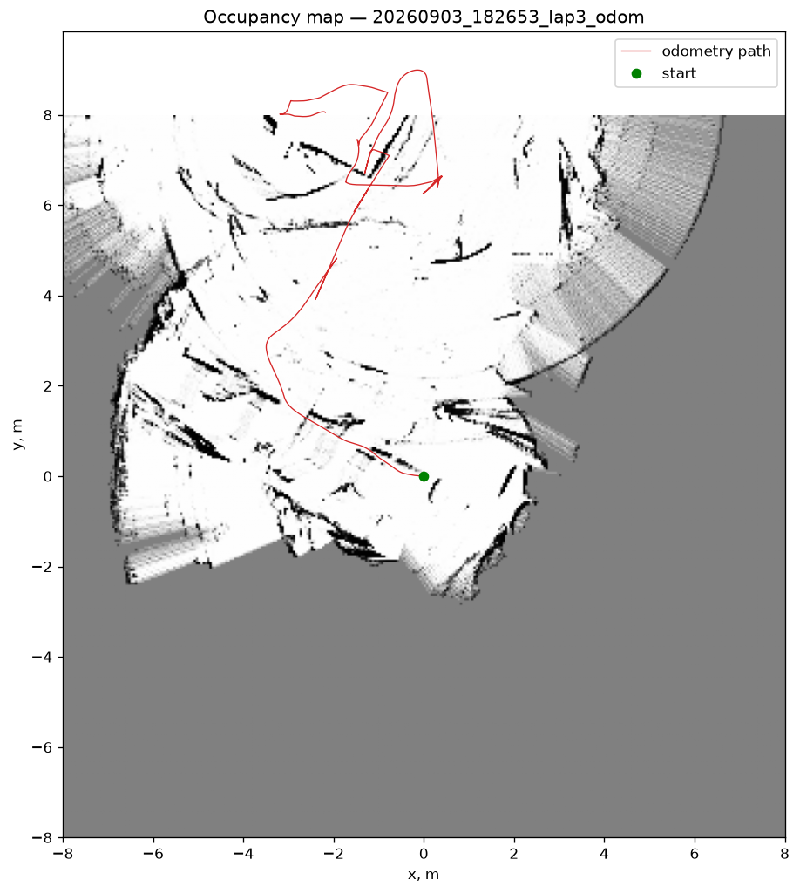
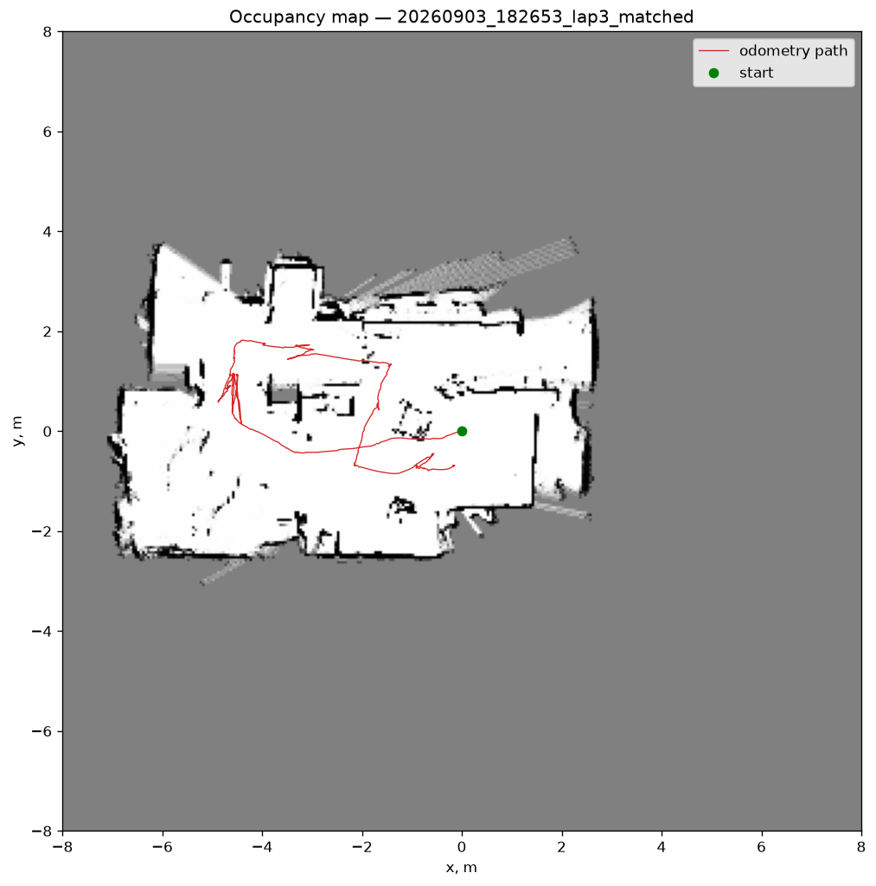
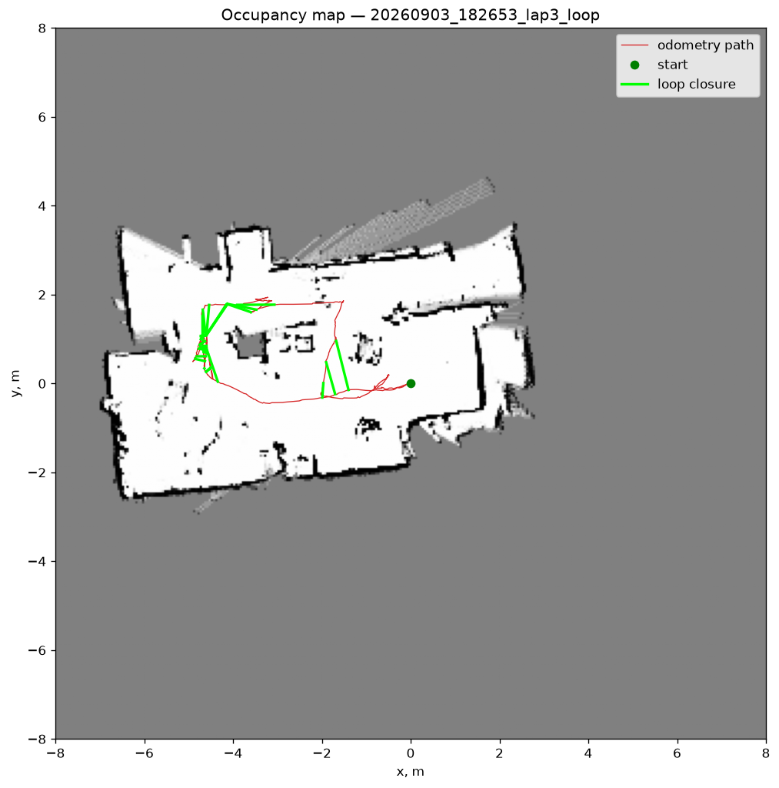
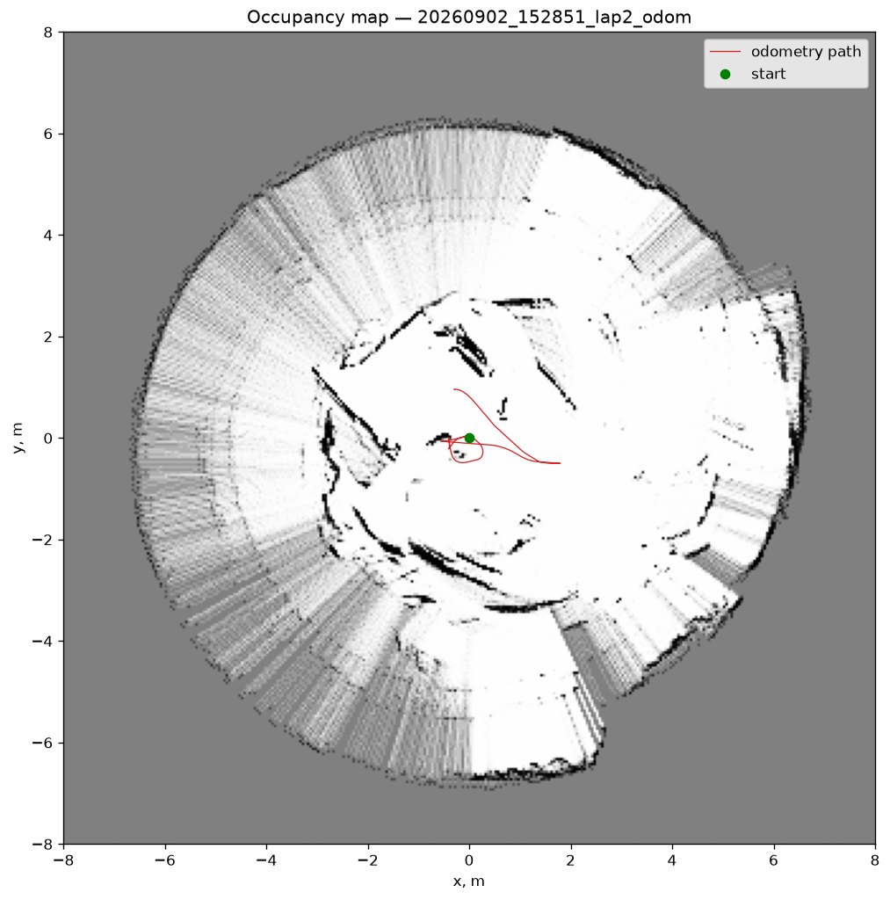
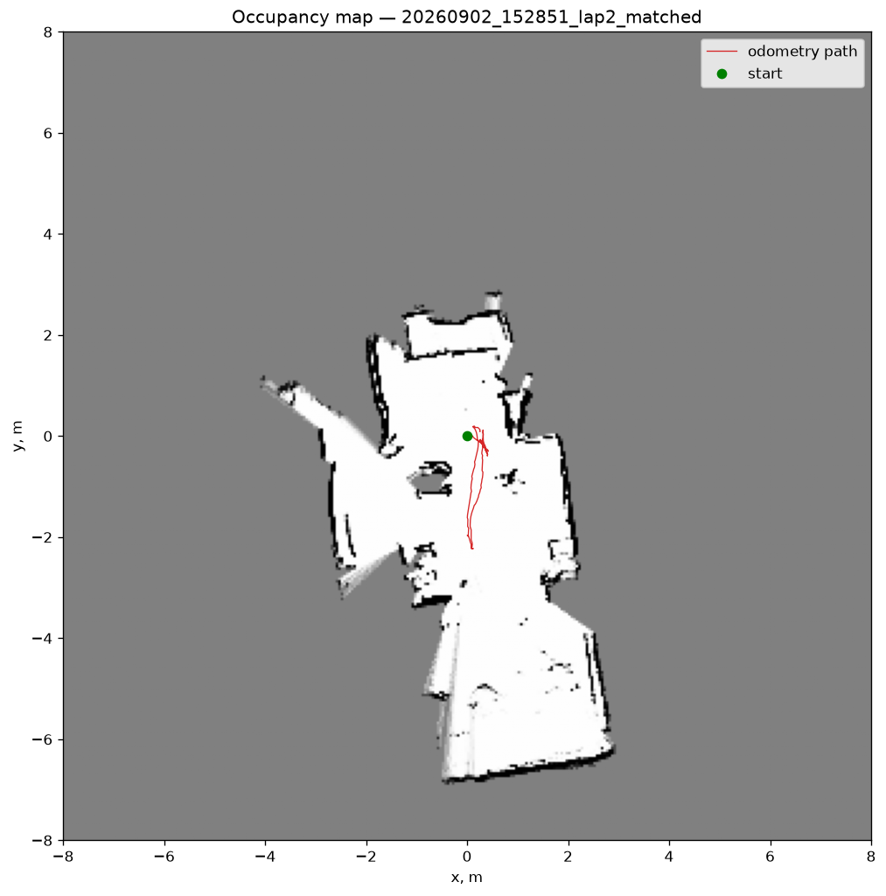
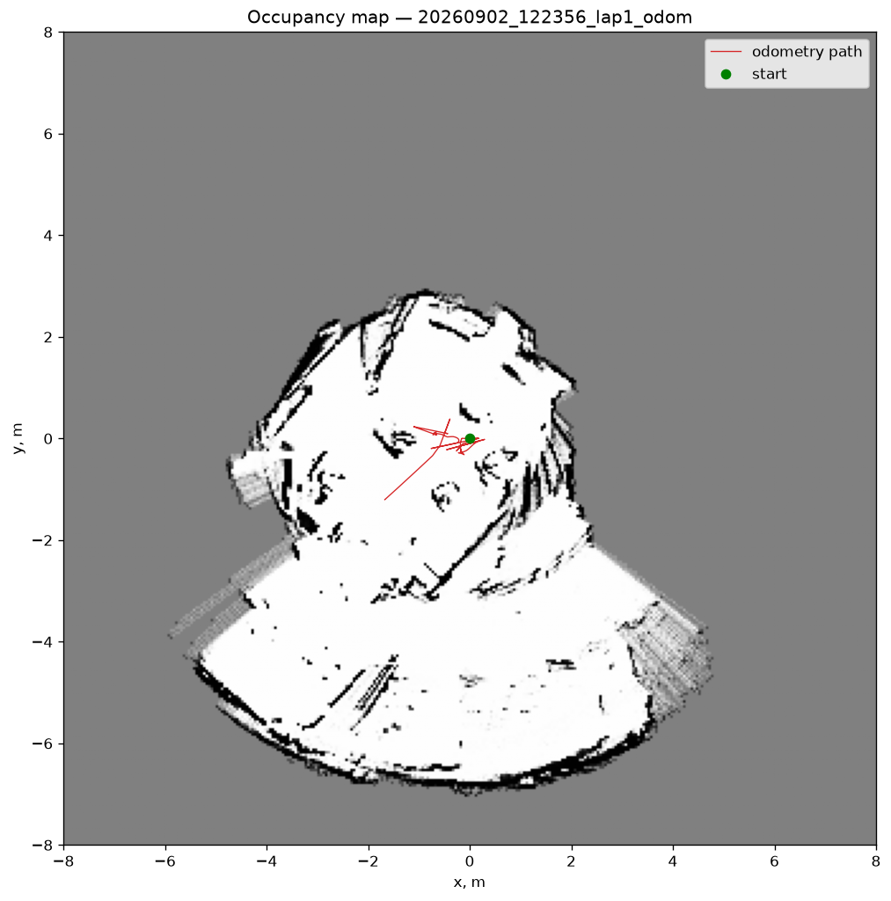
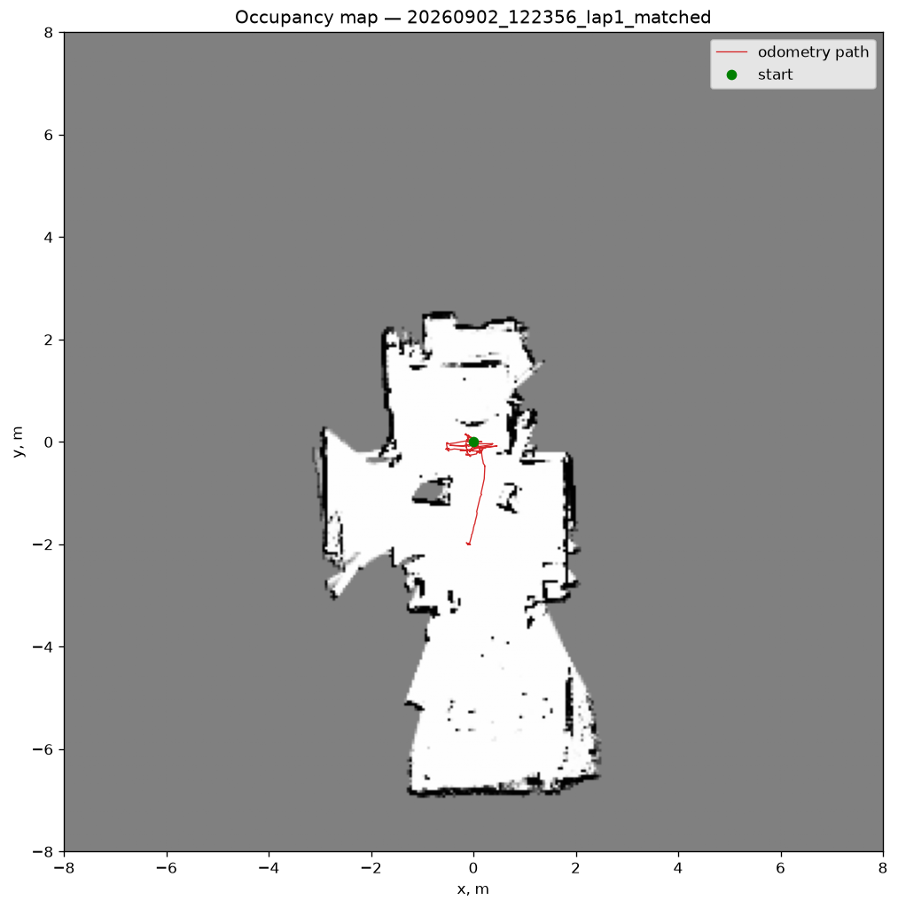

# Pepin

A home robot on an IKEA RASKOG cart: differential drive, a 6-DoF arm, a 360-degree
lidar, and a phone for a face — with the brain on a laptop and a thin relay on board.

## What it is

Pepin is a full-stack mobile manipulator built from parts you can buy: a steel kitchen
cart, ten serial-bus servos, a lidar, and a small ARM board. The board does nothing
clever — it exposes the servo bus, the lidar, the cameras, and the ToF sensors over the
network. Everything else (kinematics, odometry, scan processing, control) runs on a
laptop over wifi, so the robot's software stack is developed, profiled, and debugged on
a real machine instead of a microcontroller.

The result is a robot that maps a flat with a lidar (loop closure to 5 cm over a
33 m lap), localises on the saved map, and drives itself to a named place around
whatever the sensors see on the way — with the real-time part living on the
board, so a wifi hiccup never touches the wheels.

## Architecture

```
 18 V tool battery ──┬── 12 V rail ────────── 10x STS3215 servos (one bus, IDs 1-10)
   (XT60 inline sw)  ├── 5 V (isolated) ───── Orange Pi Zero 3
                     └── 5 V (isolated) ───── powered USB hub

  ┌──────────────┐         wifi          ┌──────────────────────┐
  │   Laptop     │  ◄──── TCP ────►      │ Orange Pi Zero 3     │
  │  "the brain" │   JSON lines both     │ Armbian              │
  │              │   ways, ~20 Hz        │  base server: wheels │
  │ localisation │                       │   odometry, deadman  │
  │ planning     │                       │  ser2net: lidar      │
  │ obstacles    │                       │  ToF server (I2C)    │
  │ guards + viz │                       │  camera streamer     │
  └──────────────┘                       └──────────┬───────────┘
  └──────────────┘                                  │
                                    ┌───────────────┼───────────────┐
                                 drive base      6-DoF arm       2-DoF neck
                                 (2 servos)     (6 servos)      (2 servos)
                                 + encoders    + wrist cam      + phone face
```

## Measured

| What | Value |
| --- | --- |
| Servo transaction round trip (laptop → wifi → bus → back) | ~9 ms median |
| Lidar scan rate | 10 rev/s, ~500 points per revolution |
| Lidar frame CRC pass rate | 100% |
| Odometry closure, forward/back run | ~10 mm |
| Wheel track | ~505 mm |
| Servos on a single bus | 10 (IDs 1-10) |

## Mapping: odometry, scan matching, loop closure

Drives of the same flat, recorded with `scripts/drive.py` and replayed with
`scripts/build_map.py`. The 33 m loop below (lap3) returned to its exact starting
point, so the distance between the end of the estimated path and its start is the
honest error of each method.

| Wheel odometry only | + correlative scan matching | + pose-graph loop closure |
| --- | --- | --- |
|  |  |  |
| path ends 8 m from the start | 0.73 m | **0.05 m** |

Left: every scan placed where the wheel encoders say the robot was — carpet slip
over-counts turns by ~14%, and dead reckoning wanders off by meters. Middle: each
keyframe's pose corrected by a brute-force correlative matcher against the map
built so far (`src/pepin/scanmatch.py`) — straight walls, rooms, doorways, but the
accumulated drift is still there. Right: keyframes as nodes of a pose graph, scan
matches as edges, revisits detected and verified (`src/pepin/slam.py`), Gauss-Newton
over SE(2) with the start pinned (`src/pepin/posegraph.py`) — the loop closes to 5 cm.

Earlier, smaller drives of the same flat:

| Wheel odometry only | + correlative scan matching |
| --- | --- |
|  |  |
|  |  |

## Hardware

- IKEA RASKOG cart, differential drive: 2x Feetech STS3215 in continuous-rotation mode,
  5" wheels, ~505 mm track
- SO-ARM101 6-DoF arm (6x STS3215) with a wrist camera
- 2-DoF neck (pan/tilt) carrying the phone that will be the robot's face
- LDRobot LD19 360-degree lidar, mounted under the mid shelf
- 3x VL53L1X time-of-flight sensors for near-field obstacles
- 4K overview camera
- Orange Pi Zero 3 (Armbian) as the onboard relay; laptop as the compute
- Single 18 V tool battery → 12 V servo rail + two isolated 5 V converters, inline
  XT60 switch

## Software

Python 3.12+, `uv`, src layout, package `pepin`. One package runs on both machines:
the board needs only the standard library.

- **Board side**: `pepin.base_server` owns the wheels (encoders and twists at 50 Hz over
  loopback to the servo bridge, a 0.5 s deadman, torque released when idle) and
  `pepin.tof_server` streams the three ToF ranges; both on one shared JSON-lines
  server. ser2net bridges the servo bus and the lidar; ustreamer serves the camera.
  See `board/README.md`.
- **Feetech bus client, written from scratch** for a lossy link: framing, checksums,
  per-request deadlines, retries, reconnect, latency telemetry.
- **Feeds**: the lidar reader, the ToF reader and the base link share one shape
  (`start/close/age_s`, never block the caller); `Robot.connect()` assembles them from
  `config/robot.json`, where a sensor is switched off with a flag, not a code edit.
- **Mapping**: log-odds occupancy grid, correlative scan matching, SE(2) pose graph with
  loop closure (`build_map.py`, `render_slam.py`).
- **Navigation**: localisation on the frozen map (a whole-map search fixes a hand-placed
  start), A* with footprint inflation and a live obstacle layer, a carrot follower, a
  sweep of the real hull through every command against the newest scan, the ToF reflex,
  named places (`--goal kitchen`) as the seam for a higher-level layer.
- **Ops**: launch-readiness health check, a macOS menu-bar monitor, a rerun dashboard,
  head-camera recording per drive, per-run logs with the git SHA; ruff, mypy strict,
  pytest split into unit and hardware tiers, a pre-commit hook that runs it all.

## Quick start

```bash
uv sync
git config core.hooksPath .githooks

uv run pytest                                          # unit tier, no robot needed
uv run python scripts/health_check.py --quick          # is everything on the board alive?
uv run python scripts/drive.py --name lap4 --video     # keyboard driving + recording
uv run python scripts/build_map.py data/sessions/<session>.jsonl --loop --save
uv run python scripts/places.py data/maps/<map>.npz add kitchen -1.5 2.0
uv run python scripts/navigate.py --map data/maps/<map>.npz --goal kitchen --video
```

## Repo layout

```
src/pepin/   drivers and links: feetech, bus, transport, lidar, tof, streams, base_link,
             base_server, tof_server, feeds, robot
             estimation: kinematics, odometry, geometry, mapping, scanmatch, posegraph,
             slam, localization
             navigation: planning, control, footprint, safety, navigator, places
             ops: health, video, recording, telemetry, log
board/       Orange Pi: ser2net, udev rules, ToF boot init, systemd units, README
config/      robot geometry, sensor mounts and feeds (JSON)
scripts/     entry points: navigate, drive, build_map, render_slam, dashboard,
             health_check, places, and the servo bench tools
apps/macos/  menu-bar health monitor
tests/       unit and hardware tiers
```

## Status and roadmap

**September 2026 — the robot drives itself to a named place on its own map.** The
wheel loop runs on the board; the laptop localises, plans around live obstacles and
guards every command with the real hull outline. Two recorded drives produce clean
occupancy maps and a pose graph closes a 33 m loop to 5 cm (see above).
Next:

1. A footprint-aware local planner (velocity sampling) so avoidance is a manoeuvre, not a stop
2. Mobile manipulation with the arm, the neck joining the same base server
3. The phone face and voice: a language layer that asks for places by name

## Credits

Built on the open-source [XLeRobot](https://github.com/Vector-Wangel/XLeRobot) platform
(dual-wheel variant) and the [LeRobot](https://github.com/huggingface/lerobot) ecosystem
for arm calibration.

License: to be added.
