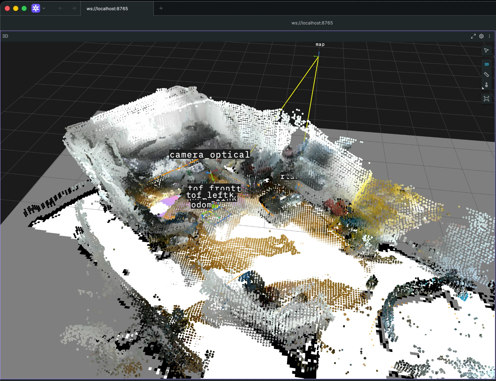
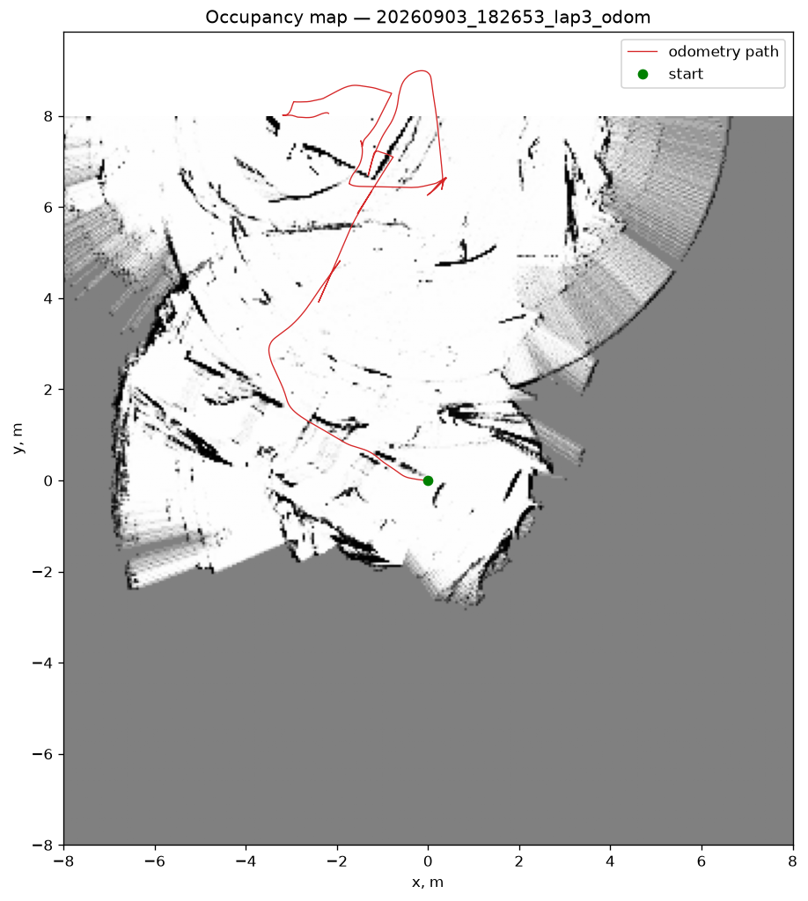
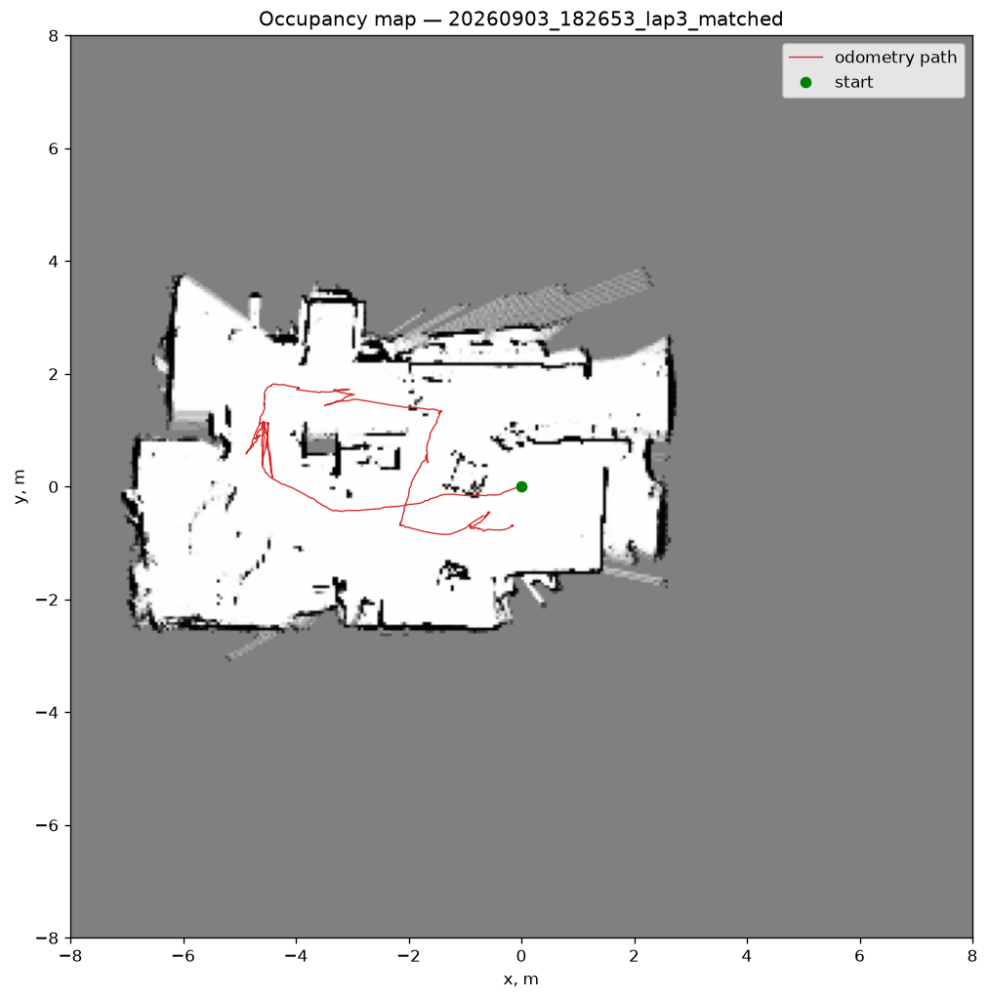
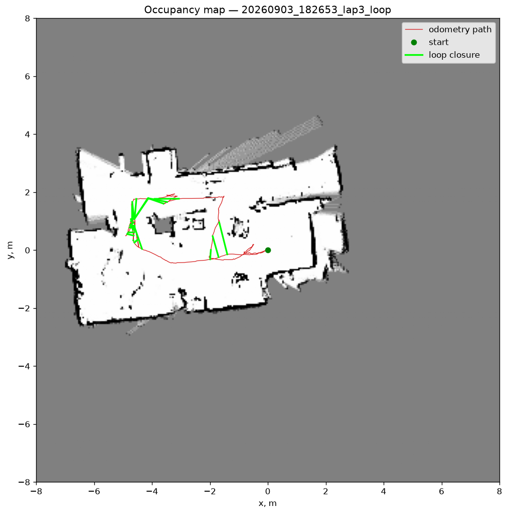

# Pepin

A home robot on an IKEA cart that drives itself to a named place in the flat, maps the rooms
with a stereo head and takes spoken orders. A $35 board on the cart streams the sensors and owns
the wheels; navigation, mapping and the language model run on the MacBook beside it.



*Foxglove on the laptop: the camera's fused voxels over the occupancy grid, with the cart's
camera, ToF and odometry frames.*

Type `ros/goto.sh printer`, or say "Pepin, go to the printer", and the cart plans around the
furniture and drives there at up to 0.45 m/s. Every drive is recorded.

## What it is

Pepin is the mobility part of a companion robot. It is built first because everything else
needs it: a frame that stays true, a body that fits through doorways, a name for every place in
the flat and a recording of every drive.

The board (Orange Pi Zero 3: four Cortex-A53 cores, 1.5 GB) is a **sensor box**. It reads the
lidar, three time-of-flight rangers, the wheel encoders, the IMU and the neck encoders. It fuses
them into `odom -> base_link` with an EKF and serves the stereo camera and the microphone array.
It owns the wheels with a 0.5 s deadman, so a WiFi stall stops the cart.

The Mac runs everything that consumes the camera, and the navigation:

- **Nav2** with the MPPI controller and Smac planners
- **RTAB-Map**, the one map and the one owner of `map -> odom`
- **stereo depth** from RAFT-Stereo on the Apple GPU, and **stereo visual odometry**
- a TSDF volume as the costmaps' obstacle memory
- **XFeat + LighterGlue + BoQ** for place recognition
- the **LLM tools** (`pepin.tools`, also an MCP server) behind a voice loop

The two machines talk over one zenoh router-to-router link.

## Numbers

Measured on the robot unless marked otherwise.

| What | Value |
| --- | --- |
| Wheel odometry / EKF, as received on the Mac | 49.5 / 48.3 Hz |
| IMU on the shared I2C bus | 99.4 Hz at 400 kHz (53 Hz at the default 100 kHz, which the ToF crowded out) |
| Stereo visual odometry | 8-10 poses/s, 0.15-0.21 s behind the picture |
| RAFT-Stereo on the Mac's GPU, 800x600 pair | 89 ms (OpenCV SGBM: 17 ms) |
| Airborne phantom blobs on glossy parquet, 8 pairs | 94 with RAFT-Stereo, 450 with SGBM |
| A stereo pair's disparity through Docker | 206 ms with the compressed reply (295 ms raw) |
| Place recognition, run 0457 replayed in RTAB-Map | BoQ descriptors: 16 of 23 camera updates localised, 15 of 15 judged right; stock ORB words: 0 |
| XFeat + LighterGlue registration, one replay | 454 ms through the model service, 1879 ms on the Docker VM's CPU |
| Top speed | 0.45 m/s (base cap = MPPI `vx_max`) |
| Goal tolerance | 0.10 m / 0.20 rad |
| Board memory, sensor stack up | 615 MB of 1.5 GB |
| Board image | 0.35 GB compressed, 1.32 GB unpacked (1.08 / 3.85 GB while it carried Nav2) |
| Loop closure over a 33 m lap, offline pose graph | 5 cm (wheel odometry alone: 8 m) |
| Unit tests | over 1,600, mypy strict, no hardware needed |

## Architecture

```
 BOARD  Orange Pi Zero 3                         │  MAC  MacBook Pro (Docker + Apple GPU)
                                                 │
 pepin-base   wheels, encoders, 50 Hz, deadman   │  pepin-macnav  Nav2 (MPPI, Smac, costmaps,
 pepin-tof    3x VL53L1X, 15 Hz                  │                behaviour tree), goal server
 ustreamer    stereo camera as MJPEG             │                :3337, run recorder
 pepin-audio  XVF3800 array + speaker            │  pepin-vslam   RTAB-Map (map -> odom), stereo
 pepin-ros    LD19 lidar, C++ base bridge,       │                depth + odometry, TSDF volume,
              IMU 100 Hz, EKF (odom->base_link), │                Foxglove bridge :8765
              rf2o laser odometry, ToF fans,     │  host          RAFT-Stereo :8790; XFeat,
              neck encoders                      │                LighterGlue, BoQ :8791
                                                 │  tools         pepin.tools (MCP), voice loop
         ◄── /cmd_vel ──── zenoh, router to router over WiFi ─────
         ──── /scan /odom /imu /tof /tf ──►
```

On the board: what is real-time, what must survive a WiFi loss, what is wired to its pins.
Every board process has a budget in `config/board_manifest.json`, and `ros/board.sh census`
checks it.

On the laptop: everything else. One `rmw_zenohd` router per machine; only the router link
crosses the radio.

## Running it

Once per clone:

```bash
uv sync
git config core.hooksPath .githooks
uv run pytest tests/unit -q -n 6
```

The board is set up by hand once ([board/README.md](board/README.md)). The images are built on
the Mac: `ros/build-image.sh --ship` for the board, `ros/laptop-build.sh` and
`ros/laptop-build.sh xfeat` for the laptop.

**Start**

```bash
ros/restart.sh both     # board sensors and router, then vslam and Nav2 here; ends green or red
ros/ready.sh            # the cart on its base: seeded, costmaps emptied, one plan proven
ros/preflight.sh        # ready for a goal? pose, lidar, planner, recognition, Foxglove, one plan
```

**Drive**

```bash
ros/goto.sh printer                      # to a named place; Ctrl-C cancels; exit 0 = reached
ros/goto.sh -1.0 0.3 90                  # to map coordinates and a heading
ros/goto.sh mark sofa                    # name the spot the cart stands on
ros/goto.sh where | places | cancel
ros/stop.sh                              # the red button
uv run python -m pepin.teleop --game     # keys held: wheels and head (not recorded)
```

Every goal leaves its tape, Nav2's reasons, the behaviour tree's transitions and a camera clip
under `ros/maps/rec/`.

**Talk**

```bash
uv run python scripts/voice.py           # GEMINI_API_KEY in the environment or .env
uv run python -m pepin.tools.mcp         # the same tools as an MCP server (Claude Code / Desktop)
```

The tools are `where_am_i`, `list_places`, `go_to`, `go_to_pose`, `cancel`, `look`,
`look_around`, `see`, `find`, `recall`, `map_tree`, `remember`, `say` and `status`. They are
defined once in `src/pepin/tools`. A drive the model abandons halts the cart.

**Calibrate**

```bash
ros/calibrate.sh --print                               # the checkerboard, A4 at 100 %
ros/calibrate.sh stereo                                # both lenses and the baseline
ros/calibrate.sh stereo --images DIR --refit-rotation  # after a remount: the eyes' rotation only
```

**Watch**: Foxglove on `ws://localhost:8765` with `ros/foxglove/pepin_slam.json`
(`ros/foxglove.sh check`). The menu-bar app ([apps/macos](apps/macos/README.md)) shows both
halves' health and has the red button.

The full operating manual is [ros/README.md](ros/README.md): deploying a change, the restart
checks, the feature flags, recording, the model services and the board's budget.

## How a goal runs

1. `ros/goto.sh` writes one JSON line to the goal server beside Nav2. No process starts on the
   board, so the cart leaves at once.
2. The goal server looks the name up in the places book, which rides RTAB-Map's graph nodes. It
   numbers the run, opens the tape (which already holds the last 15 s of every topic) and sends
   the pose to Nav2.
3. Smac Hybrid-A* (the saved pick; `ros/goto.sh planner NAME` swaps it) plans with the cart's
   true footprint, and MPPI follows the plan at 10 Hz. The local costmap is in `odom`; the
   global costmap reads RTAB-Map's `/map`.
4. `/cmd_vel` crosses to the board. The C++ base bridge hands it to the base server, which
   applies it at 50 Hz next to the UART.
5. Coming back: the EKF fuses the wheels, the gyro, the stereo odometry and the lidar's
   scan-to-scan odometry into `odom -> base_link`. RTAB-Map's `map -> odom` corrects it.

The costmaps hear the lidar, the three ToF fans and the camera. The camera reaches them through
the TSDF volume, so a single bad stereo frame cannot paint a wall.

## The map it started from

The first map was built offline from one recorded 33 m lap that returned to its start. Each
stage cut the closing error: wheel odometry alone ended 8 m away, correlative scan matching
0.73 m, and pose-graph loop closure 5 cm (`scripts/build_map.py`, `src/pepin/slam.py`,
`posegraph.py`). The live map is RTAB-Map's now.

| Wheel odometry only | + correlative scan matching | + pose-graph loop closure |
| --- | --- | --- |
|  |  |  |

## Hardware

- IKEA RASKOG cart, differential drive: 2x Feetech STS3215 in wheel mode, 0.125 m wheels, 0.505 m
  track, one serial bus
- Orange Pi Zero 3 (Armbian), 4x Cortex-A53, 1.5 GB
- LDRobot LD19 360° lidar, mounted upside down at 0.383 m
- 3x VL53L1X time-of-flight rangers (front, left, right) and an MPU6050 IMU, on one I2C bus
- Global-shutter stereo module (2x 800x600, 61 mm baseline) on a 2-DoF pan/tilt neck
- reSpeaker XVF3800 microphone array, with the speaker on its jack
- 18 V tool battery: a 12 V servo rail and two isolated 5 V rails
- A 6-DoF SO-ARM101, not yet part of the stack

Footprint 0.0625 m ahead of the axle, 0.30 m behind it, 0.275 m half-width. The planners use
it with zero padding, because parking against furniture is the normal case.

Compute cost: the $35 board on the cart and the MacBook. No cloud GPU; the voice loop calls the
Gemini API.

## Repo layout

```
src/pepin/     the Python library: board servers (base, ToF, audio), clients, the depth,
               volume and lean models, places, tapes, the LLM tools; imported by ros/, never
               the reverse
ros/           pepin_bringup (nodes, launch files), pepin_base_cpp (the C++ base bridge),
               params/, Dockerfiles, the shell one-liners, tools/, replay/, sim/, xfeat/
board/         the board's systemd units, udev rules, ser2net, ToF init, chrony, overlays
apps/macos/    the menu-bar app
config/        geometry, mounts, calibrations, knobs and the board's process manifest (JSON)
scripts/       laptop entry points: voice, health check, dashboard, calibration, map building
tests/         unit (fast, no robot) and hardware (--hardware)
```

pre-commit runs `bash -n`, ruff and `mypy --strict`. pre-push runs the whole unit suite in
parallel, with a coverage floor and the flags-doc check.

## Credits

Built on the open-source [XLeRobot](https://github.com/Vector-Wangel/XLeRobot) platform
(dual-wheel variant) and the [LeRobot](https://github.com/huggingface/lerobot) ecosystem for arm
calibration. RAFT-Stereo is vendored from
[princeton-vl/RAFT-Stereo](https://github.com/princeton-vl/RAFT-Stereo) (MIT), the SO-101 URDF
from [TheRobotStudio/SO-ARM100](https://github.com/TheRobotStudio/SO-ARM100) (Apache-2.0).

License: to be added.
