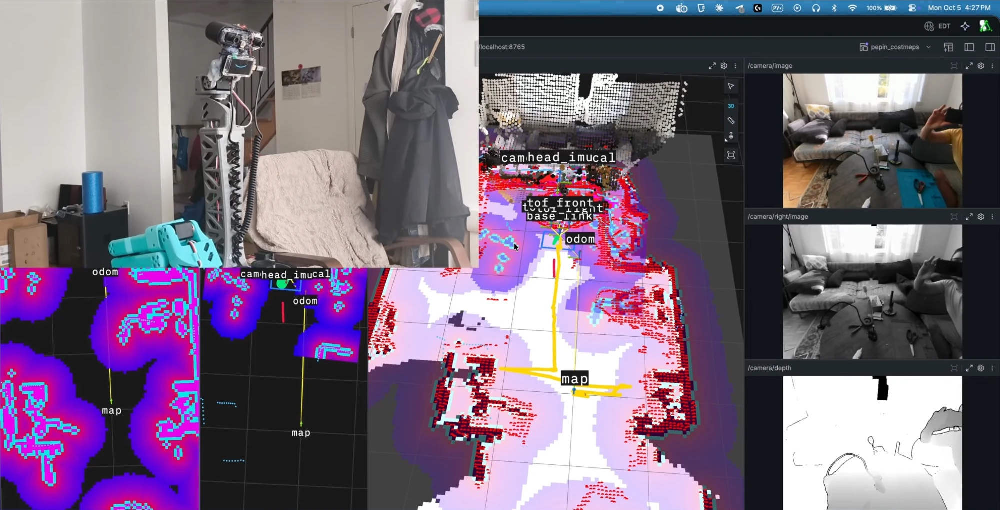

# Pepin

A home robot on an IKEA cart that drives itself to a named place in the flat, maps the rooms
with a stereo head and takes spoken orders. A $35 board on the cart streams the sensors and owns
the wheels; navigation, mapping and the language model run on the MacBook beside it.

[](https://vimeo.com/1233169078)

▶ **[Watch the video on Vimeo](https://vimeo.com/1233169078)**: "Pepin, go to the printer" —
it answers, plans around the furniture, drives there, looks down at the printer while it parks
and reports back.

Say "Pepin, go to the printer" (or type `ros/goto.sh printer`), and the cart plans around the
furniture and drives there at up to 0.30 m/s. Every drive is recorded.

## What it is, in one minute

Pepin is the moving body of a companion robot that lives in a flat. You talk to it; it knows
the rooms by name, finds its way between them, and looks where it is going with a camera head
on a neck, the way a person would — ahead along its path, down at the spot where it parks,
behind itself when it backs up. A small screen gives it a mouth that moves when it speaks and
changes with what it is doing.

It is built from off-the-shelf parts: an IKEA trolley, two servo wheels, a $35 computer, a
lidar, a stereo camera and a microphone array. The heavy thinking (maps, planning, vision,
the voice) runs on an ordinary laptop over WiFi. The whole stack is open: code, configuration,
calibration and the record of every drive.

## Under the hood

The board (Orange Pi Zero 3: four Cortex-A53 cores, 1.5 GB) is a **sensor box**. It reads the
lidar, three time-of-flight rangers, the wheel encoders, the base IMU and the neck encoders, and
fuses them into `odom -> base_link` with an **EKF** (robot_localization). It serves the stereo
camera, the microphone array and the head (an ESP32 with the face screen and a second IMU glued
to the camera). It owns the wheels with a 0.5 s deadman, so a WiFi stall stops the cart.

The Mac runs everything that consumes the camera, and the navigation:

- **Nav2**: Smac Hybrid-A* plans with the cart's real footprint; a rotation shim with
  **Regulated Pure Pursuit** follows the path and **MPPI** takes over for the last metre to
  park against furniture
- **RTAB-Map**: the one map and the one owner of `map -> odom`; place recognition with
  **XFeat + LighterGlue + BoQ**
- **stereo depth** from **RAFT-Stereo** on the Apple GPU, the head calibrated with **Kalibr**
  (both eyes, and the camera-IMU extrinsics and time offset)
- **visual-inertial odometry**: **OpenVINS** on the stereo head and its IMU (zero-velocity
  updates at rest, a guard that refuses samples the wheels contradict), fed to the board's EKF
  beside the wheels, the gyro and the lidar's scan-to-scan odometry (**rf2o**); the stereo
  visual odometry stays as the alternative
- a **TSDF volume** as the costmaps' obstacle memory, with the robot's own body and its arm
  (posed by forward kinematics) masked out of every camera ray
- an **active gaze**: one arbiter owns the neck; the head follows the path, looks at the parking
  spot and behind when reversing, and when the controller stalls it looks at the blocking
  voxels to confirm them or carve a phantom away; frames taken during a head move or a mast
  sway (measured by the head IMU) are kept out of the map
- **voice**: a local **Whisper** wake word, the conversation on the **Gemini Live API** (native
  audio both ways), the **reSpeaker XVF3800** array on the cart, the mouth lip-synced to the
  speech; the **LLM tools** (`pepin.tools`, also an MCP server) drive the robot

The two machines talk over one **zenoh** router-to-router link (rmw_zenoh, with the upstream
lost-wake-up fix backported). Every feature is a live flag with its measurement beside it.

## Numbers

Measured on the robot unless marked otherwise.

| What | Value |
| --- | --- |
| Wheel odometry / EKF, as received on the Mac | 49.5 / 48.3 Hz |
| IMU on the shared I2C bus | 99.4 Hz at 400 kHz (53 Hz at the default 100 kHz, which the ToF crowded out) |
| Stereo visual odometry | 8-10 poses/s, 0.15-0.21 s behind the picture |
| Visual-inertial odometry (OpenVINS) into the EKF | 9-10 Hz while driving; at rest 0 mm and 0.000° over 38 min with ZUPT |
| Head calibration (Kalibr), two runs | camera-IMU rotation 0.03° apart, 3.4 mm, 0.2 ms; stereo reprojection 0.56 px |
| Floor 0.5-1.5 m ahead in the stereo depth, seven head poses | within 5 mm of flat after the Kalibr stereo calibration (15-24 cm low before) |
| Own body and arm in the voxel volume, full head sweep | 0 voxels (344 without the masks) |
| RAFT-Stereo on the Mac's GPU, 800x600 pair | 89 ms (OpenCV SGBM: 17 ms) |
| Airborne phantom blobs on glossy parquet, 8 pairs | 94 with RAFT-Stereo, 450 with SGBM |
| A stereo pair's disparity through Docker | 206 ms with the compressed reply (295 ms raw) |
| Place recognition, run 0457 replayed in RTAB-Map | BoQ descriptors: 16 of 23 camera updates localised, 15 of 15 judged right; stock ORB words: 0 |
| XFeat + LighterGlue registration, one replay | 454 ms through the model service, 1879 ms on the Docker VM's CPU |
| Top speed | 0.30 m/s (the wheel servos measure 0.31-0.32 m/s on the floor) |
| Goal tolerance | 0.10 m / 0.20 rad |
| Board memory, sensor stack up | 615 MB of 1.5 GB |
| Board image | 0.35 GB compressed, 1.32 GB unpacked (1.08 / 3.85 GB while it carried Nav2) |
| Loop closure over a 33 m lap, offline pose graph | 5 cm (wheel odometry alone: 8 m) |
| Unit tests | over 2,000, mypy strict, no hardware needed |

## Architecture

```
 BOARD  Orange Pi Zero 3                         │  MAC  MacBook Pro (Docker + Apple GPU)
                                                 │
 pepin-base   wheels, encoders, neck, 50 Hz,     │  pepin-macnav  Nav2 (shim + RPP, MPPI, Smac,
              deadman                            │                costmaps, behaviour tree),
 pepin-tof    3x VL53L1X, 15 Hz                  │                goal server :3337, gaze
 ustreamer    stereo camera as MJPEG             │                arbiter :3339, run recorder
 pepin-audio  XVF3800 array + speaker, lip sync  │  pepin-vslam   RTAB-Map (map -> odom), stereo
 pepin-head   ESP32: face screen, head IMU 200 Hz│                depth + VO, TSDF volume,
 pepin-ros    LD19 lidar, C++ base bridge,       │                Foxglove bridge :8765
              IMU 100 Hz, EKF (odom->base_link), │  pepin-vio     OpenVINS (head camera + IMU)
              rf2o laser odometry, ToF fans,     │  host          RAFT-Stereo :8790; XFeat,
              neck encoders, mast-sway filter    │                LighterGlue, BoQ :8791
                                                 │  tools         pepin.tools (MCP), voice loop
         ◄── /cmd_vel ──── zenoh, router to router over WiFi ─────
         ──── /scan /odom /imu /tof /tf ──►
```

On the board: what is real-time, what must survive a WiFi loss, what is wired to its pins.
Every board process has a budget in `config/board_manifest.json`, and `ros/board.sh census`
checks it.

On the laptop: everything else. One `rmw_zenohd` router per machine; only the router link
crosses the radio.

## Running it

Once per clone:

```bash
uv sync
git config core.hooksPath .githooks
uv run pytest tests/unit -q -n 6
```

The board is set up by hand once ([board/README.md](board/README.md)). The images are built on
the Mac: `ros/build-image.sh --ship` for the board, `ros/laptop-build.sh` and
`ros/laptop-build.sh xfeat` for the laptop.

**Start**

```bash
ros/restart.sh both     # board sensors and router, then vslam and Nav2 here; ends green or red
ros/ready.sh            # the cart on its base: seeded, costmaps emptied, one plan proven
ros/preflight.sh        # ready for a goal? pose, lidar, planner, recognition, Foxglove, one plan
```

**Drive**

```bash
ros/goto.sh printer                      # to a named place; Ctrl-C cancels; exit 0 = reached
ros/goto.sh -1.0 0.3 90                  # to map coordinates and a heading
ros/goto.sh mark sofa                    # name the spot the cart stands on
ros/goto.sh where | places | cancel
ros/stop.sh                              # the red button
uv run python -m pepin.teleop --game     # keys held: wheels and head (not recorded)
```

Every goal leaves its tape, Nav2's reasons, the behaviour tree's transitions and a camera clip
under `ros/maps/rec/`.

**Talk**

```bash
uv run python scripts/voice_live.py      # "Пепин, ..." — Gemini Live; GEMINI_API_KEY in .env
uv run python -m pepin.tools.mcp         # the same tools as an MCP server (Claude Code / Desktop)
```

The tools are `where_am_i`, `list_places`, `go_to`, `go_to_pose`, `cancel`, `look`,
`look_around`, `see`, `find`, `recall`, `map_tree`, `remember`, `say` and `status`. They are
defined once in `src/pepin/tools`. A drive the model abandons halts the cart.

**Calibrate**

```bash
ros/calibrate.sh --print                               # the checkerboard, A4 at 100 %
ros/calibrate.sh stereo                                # both lenses and the baseline
ros/calibrate.sh stereo --images DIR --refit-rotation  # after a remount: the eyes' rotation only
```

**Watch**: Foxglove on `ws://localhost:8765` with `ros/foxglove/pepin_slam.json`
(`ros/foxglove.sh check`). The menu-bar app ([apps/macos](apps/macos/README.md)) shows both
halves' health and has the red button.

The full operating manual is [ros/README.md](ros/README.md): deploying a change, the restart
checks, the feature flags, recording, the model services and the board's budget.

## How a goal runs

1. `ros/goto.sh` writes one JSON line to the goal server beside Nav2. No process starts on the
   board, so the cart leaves at once.
2. The goal server looks the name up in the places book, which rides RTAB-Map's graph nodes. It
   numbers the run, opens the tape (which already holds the last 15 s of every topic) and sends
   the pose to Nav2.
3. Smac Hybrid-A* (the saved pick; `ros/goto.sh planner NAME` swaps it) plans with the cart's
   true footprint. A rotation shim with Regulated Pure Pursuit follows the plan at 10 Hz and
   hands over to MPPI within a metre of the goal (`ros/goto.sh controller` swaps the pair).
   The local costmap is in `odom`; the global costmap reads RTAB-Map's `/map`.
4. `/cmd_vel` crosses to the board. The C++ base bridge hands it to the base server, which
   applies it at 50 Hz next to the UART. Meanwhile the gaze arbiter turns the head along the
   path, down at the goal while parking and behind on a reverse; on a stall it looks at what
   blocks the way before the tree replans.
5. Coming back: the EKF fuses the wheels, the gyro, the visual-inertial odometry and the
   lidar's scan-to-scan odometry into `odom -> base_link`. RTAB-Map's `map -> odom` corrects it.

The costmaps hear the lidar, the three ToF fans and the camera. The camera reaches them through
the TSDF volume, so a single bad stereo frame cannot paint a wall.

## The map it started from

The first map was built offline from one recorded 33 m lap that returned to its start. Each
stage cut the closing error: wheel odometry alone ended 8 m away, correlative scan matching
0.73 m, and pose-graph loop closure 5 cm (`scripts/build_map.py`, `src/pepin/slam.py`,
`posegraph.py`). The live map is RTAB-Map's now.

| Wheel odometry only | + correlative scan matching | + pose-graph loop closure |
| --- | --- | --- |
|  |  |  |

## Hardware

- IKEA RASKOG cart, differential drive: 2x Feetech STS3215 in wheel mode, 0.125 m wheels, 0.505 m
  track, one serial bus
- Orange Pi Zero 3 (Armbian), 4x Cortex-A53, 1.5 GB
- LDRobot LD19 360° lidar, mounted upside down at 0.383 m
- 3x VL53L1X time-of-flight rangers (front, left, right) and an MPU6050 IMU, on one I2C bus
- Global-shutter stereo module (2x 800x600, 61 mm baseline) on a 2-DoF pan/tilt neck
- The head: an ESP32 with a 1.9" ST7789 screen (the mouth) and an MPU6050 glued to the camera
  for the visual-inertial odometry and the mast's sway
- reSpeaker XVF3800 microphone array, with the speaker on its jack
- 18 V tool battery: a 12 V servo rail and two isolated 5 V rails
- A 6-DoF SO-ARM101, parked: masked out of the camera's view, not yet driven by the stack

Footprint 0.0625 m ahead of the axle, 0.30 m behind it, 0.275 m half-width. The planners use
it with zero padding, because parking against furniture is the normal case.

Compute cost: the $35 board on the cart and the MacBook. No cloud GPU; the voice loop calls the
Gemini API.

## Repo layout

```
src/pepin/     the Python library: board servers (base, ToF, audio), clients, the depth,
               volume and lean models, places, tapes, the LLM tools; imported by ros/, never
               the reverse
ros/           pepin_bringup (nodes, launch files), pepin_base_cpp (the C++ base bridge),
               params/, Dockerfiles, the shell one-liners, tools/, replay/, sim/, xfeat/
board/         the board's systemd units, udev rules, ser2net, ToF init, chrony, overlays
apps/macos/    the menu-bar app
config/        geometry, mounts, calibrations, knobs and the board's process manifest (JSON)
scripts/       laptop entry points: voice, health check, dashboard, calibration, map building
tests/         unit (fast, no robot) and hardware (--hardware)
```

pre-commit runs `bash -n`, ruff and `mypy --strict`. pre-push runs the whole unit suite in
parallel, with a coverage floor and the flags-doc check.

## Credits

Built on the open-source [XLeRobot](https://github.com/Vector-Wangel/XLeRobot) platform
(dual-wheel variant) and the [LeRobot](https://github.com/huggingface/lerobot) ecosystem for arm
calibration. RAFT-Stereo is vendored from
[princeton-vl/RAFT-Stereo](https://github.com/princeton-vl/RAFT-Stereo) (MIT), the SO-101 URDF
from [TheRobotStudio/SO-ARM100](https://github.com/TheRobotStudio/SO-ARM100) (Apache-2.0).

License: to be added.
